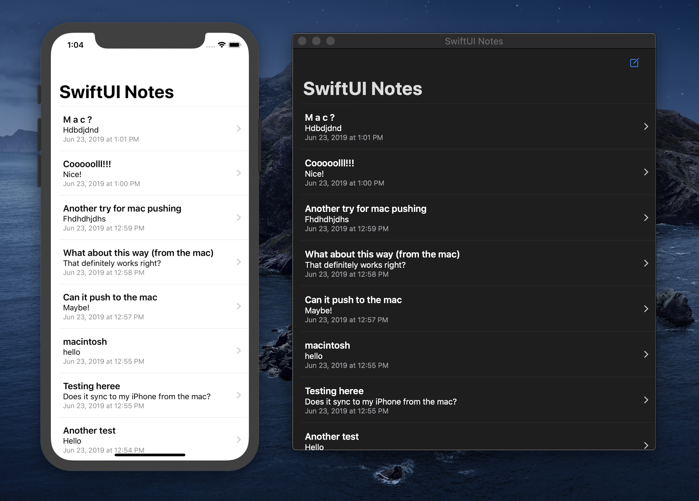

## SwiftUI Notes

A laughably simple sample app for experimenting with SwiftUI and a CloudKit-backed CoreData store.

<p align="center">
    
</p>

### [`AppDelegate.swift`](https://github.com/calda/SwiftUI-Notes/blob/master/SwiftUI%20Notes/AppDelegate.swift)

Enabling iCloud syncing, merging, and remote-change push notifications:

```swift
lazy var persistentContainer: NSPersistentCloudKitContainer = {
    let container = NSPersistentCloudKitContainer(name: "SwiftUI_Notes")

    container.persistentStoreDescriptions.first?
        .setOption(true as NSNumber, forKey: NSPersistentStoreRemoteChangeNotificationPostOptionKey)

    container.loadPersistentStores(completionHandler: { (storeDescription, error) in
        if let error = error as NSError? {
            fatalError("Unresolved error \(error), \(error.userInfo)")
        }
    })

    container.viewContext.mergePolicy = NSMergeByPropertyObjectTrumpMergePolicy
    container.viewContext.automaticallyMergesChangesFromParent = true

    return container
}()
```


### [`NoteList.swift`](https://github.com/calda/SwiftUI-Notes/blob/master/SwiftUI%20Notes/NoteList.swift)

A sample SwiftUI `List` backed by a `FetchedResultsController`


```swift
struct NoteList: View {

    @ObjectBinding var resultsController = FetchedResultsController(
        with: FetchRequest(for: Note.self)
            .sorted(by: \.lastModificationDate, ascending: false))

    var body: some View {
        NavigationView {
            List {
                ForEach(resultsController.objects) { note in
                    NoteCell(note: note)
                }
            }   
        }
    }

}
```

[`FetchedResultsController`](https://github.com/calda/SwiftUI-Notes/blob/master/SwiftUI%20Notes/Extensions/Core%20Data/FetchedResultsController.swift) is a Swift interface around an `NSFetchedResultsController` that conforms to `BindableObject`.
